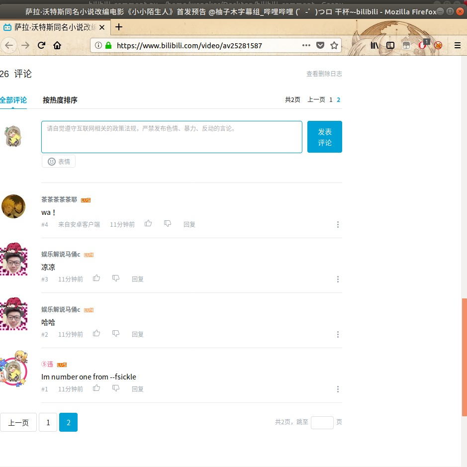
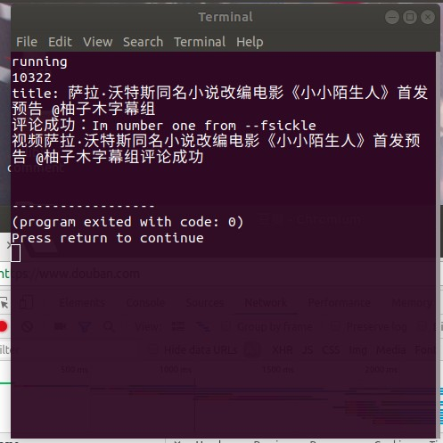

此为在 bilibili 抢占 UP 主最新视频的评论楼，可指定楼层
可在<a href="https://passport.bilibili.com/ajax/miniLogin/minilogin">
    快速登陆入口</a>,从 cookie 中获取： 
    <ul>
    <li>"DedeUserID":用户ID</li>
    <li>"DedeUserID__ckMd5":用户ID_MD5值</li>
    <li>"SESSDATA":会话cookie</li>
    <li>"bili_jct":crsf cookie</li>
    </ul>
    运行程序，輸入cookie獲得的內容，以及 Up ID，你的評論，評論期望的層數，即可 
    程序查询时间为 numpy
    程序成功截图 
    
    
